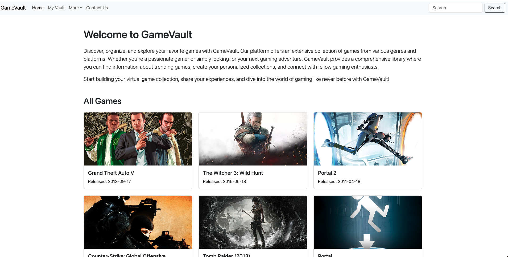

# Game Library API

This is a Ruby on Rails API for managing a game library. It utilizes the RAWG API to seed initial data into the database. Users can manage their game collections by adding, updating, and deleting games.


## Table of Contents

- [Installation](#installation)
- [Usage](#usage)
- [Endpoints](#endpoints)
- [Authentication](#authentication)
- [Database Schema](#database-schema)
- [Dependencies](#dependencies)
- [Contributing](#contributing)
- [License](#license)

## Installation

To set up this API locally, follow these steps:

1. **Clone the repository:**

   ```
   git clone https://github.com/dmcgee2001/capstone-project.git
   cd capstone-project
   ```

2. **Install dependencies:**

   Ensure you have Ruby and Rails installed. Then, run:

   ```
   bundle install
   ```

3. **Set up the database:**

   ```
   rails db:create
   rails db:migrate
   ```

4. **Seed initial data from RAWG API:**

   ```
   rails db:seed
   ```

5. **Start the server:**

   ```
   rails server
   ```

## Usage

To use this API, make HTTP requests to the provided endpoints (detailed below). Ensure to authenticate where necessary (see Authentication section).

## Endpoints

### Games

- `GET /games`: Retrieve a list of all games.
- `GET /games/:id`: Retrieve details of a specific game.
- `POST /games`: Create a new game entry.
- `PUT /games/:id`: Update details of a specific game.
- `DELETE /games/:id`: Delete a specific game.

### Collection

- `GET /collection`: Retrieve a user's game collection.
- `POST /collection/:id`: Add a game to a user's collection.
- `DELETE /collection/:id`: Remove a game from a user's collection.

## Authentication

This API uses JWT (JSON Web Tokens) for authentication. Users need to authenticate to access certain endpoints (e.g., modifying collections). Please refer to the JWT gem documentation for details on how to authenticate requests.

## Database Schema

The database schema for this application includes tables for `games`, `users`, and `collections`, and associations to manage user-game collections.

For a detailed schema, refer to `db/schema.rb`.

## Dependencies

This project uses the following gems:

- [JWT Gem](https://github.com/jwt/ruby-jwt): For JSON Web Token authentication.
- [Rack CORS Gem](https://github.com/cyu/rack-cors): For Cross-Origin Resource Sharing.
- [BCrypt Gem](https://github.com/codahale/bcrypt-ruby): For password hashing.

## Contributing

Contributions are welcome! If you want to contribute to this project, please follow the typical GitHub flow:

1. Fork the repository.
2. Create a new branch (`git checkout -b feature/your-feature`).
3. Make your changes.
4. Commit your changes (`git commit -am 'Add new feature'`).
5. Push to the branch (`git push origin feature/your-feature`).
6. Create a pull request.
